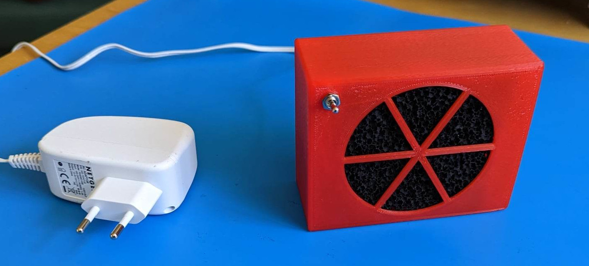
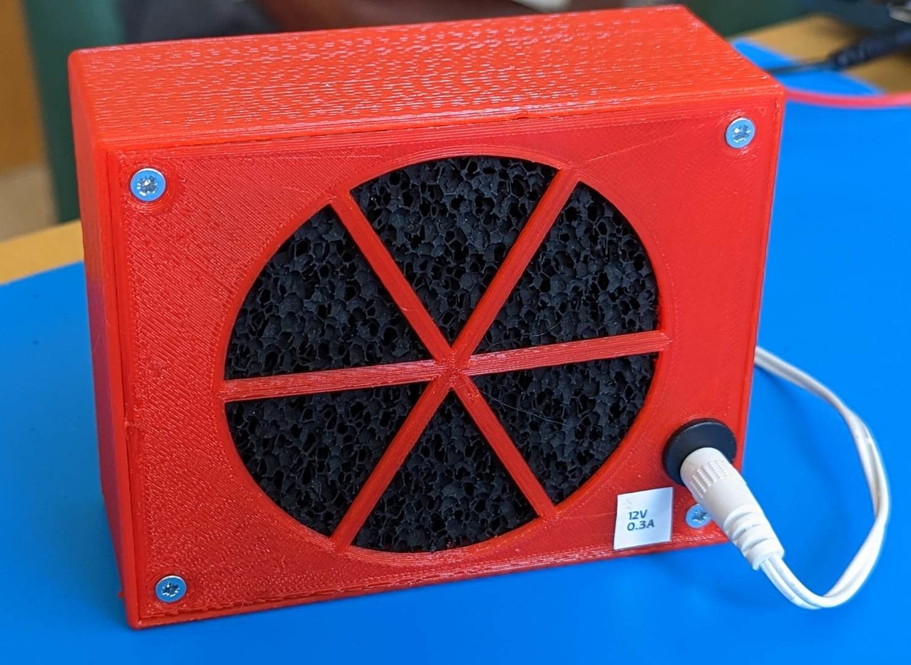

# Fume Extractor

Fits 80 mm fan by default. Lots of parameters.

## TODO

* Too tight, needs more distance between fan and filters. Needs some slack.
* Or maybe just need to add slack for filter thickness.
* Fastener system needs solid print for nuts to embed'
* The fan holder stuff needs to be longer -- needs to meet the lid stuff
* Lid needs to be stiffer / thicker.
* Needs larger fan / 24V fan / fan that sucks more.

## Images

